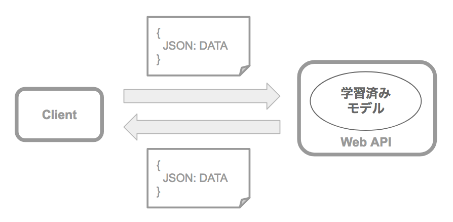

# 4 機械学習プロセス

機械学習は以下の流れで作業を進めます。


## 4.1 データの前処理

機械学習に取り組むには学習に利用するデータを準備する必要があります。

1. データの収集
2. 欠損値処理
3. スケーリング処理
4. 訓練データとテストデータの分割

機械学習というとアルゴリズムに注目が集まりがちですが、実際の開発現場ではこれらの前処理に時間がかかるのが普通です。

<div style="page-break-before:always"></div>

### データの前処理 - 1. データの収集

機械学習を始めるとき、多くの場合において、目的に合わせたデータを収集するところからスタートすることになるでしょう。企業の持つデータベースに対してSQLを発行してデータを収集するケースもあれば、システムのログファイルなどからデータを収集するケースもあるでしょう。

組織内にデータが存在しない場合は、インターネット上の学習データを活用することもできます。たとえば手書き数字データセットであるMNISTは、画像認識プログラムの題材として頻繁に利用されています。このようなインターネット上の共有データセットを使えば簡単に機械学習を始めることができます。

|データセット|URL|概要|
|:--|:--|:--|
|MNIST| http://yann.lecun.com/exdb/mnist/ |手書き数字データセット。60,000枚の訓練データ、10,000枚のテストデータが配布されている。1枚の画像はグレースケールで、サイズは28x28ピクセル。|
|Iris| https://archive.ics.uci.edu/ml/datasets/iris |アヤメの品種データセット。花びらの縦、横サイズ、萼（がく）の縦、横サイズの4列と品種を含めた5列で構成される。|
|Boston Housing| http://lib.stat.cmu.edu/datasets/boston |ボストンの住宅価格データセット。住宅の平均部屋数や犯罪発生数、税率といった地域情報と住宅価格の関係を定義したもの。|

> インターネット上には他にも機械学習で利用可能な大規模なデータベースも公開されています。スタンフォード大学が運営するImageNetには、インターネット上の画像を集めて分類したデータセットが公開されています。 http://www.image-net.org/

ここではIrisデータセットを例に見てみましょう。Irisデータセットは次の5つの属性（列）で構成されています。

1. sepal length in cm（がくの縦幅）
2. sepal width in cm（がくの横幅）
3. petal length in cm（花びらの縦幅）
4. petal width in cm（花びらの横幅）
5. class: （品種）
   - Iris Setosa
   - Iris Versicolor
   - Iris Virginica

具体的には次のようなファイルです。

```
5.3,3.7,1.5,0.2,Iris-setosa
5.0,3.3,1.4,0.2,Iris-setosa
7.0,3.2,4.7,1.4,Iris-versicolor
6.4,3.2,4.5,1.5,Iris-versicolor
6.9,3.1,4.9,1.5,Iris-versicolor
...省略
```

各レコードの1列目はsepal length、2列目はsepal width、3列目はpetal length、4列目はpetal width、5列目はclassを意味しています。またIrisデータセットは各品種につき50件ずつ、合計150件のレコードで構成されています。

#### 量的データと質的データ

機械学習でデータを扱うときは量的データ、質的データという観点で確認することも大切です。Irisデータセットの各列について見てみましょう。1列目のsepal lengthから4列目はpetal widthまではいずれも数量データとなっています。これらは量的データに分類されます。5列目のclassはIris Setosa、Iris Versicolor、Iris Virginicaの3つの値をとるカテゴリーデータです。これは質的データに分類されます。

機械学習で利用するデータは数値に置き換えて処理します。先述のIrisデータのclass列は文字データ（カテゴリーデータ）であるため、次のように置き換えて処理します。

+ class: （品種）
  + Iris Setosa => 0
  + Iris Versicolour => 1
  + Iris Virginica => 2

```
sepal length,sepal width,petal length,petal width,class
5.3,3.7,1.5,0.2,0
5.0,3.3,1.4,0.2,0
7.0,3.2,4.7,1.4,1
6.4,3.2,4.5,1.5,1
6.9,3.1,4.9,1.5,1
```

またカテゴリーデータは次のように変換することも一般的です。

|sepal<br> length|sepal<br> width|petal<br> length|petal<br> width|Iris-<br>Setosa|Iris-<br>Versicolor|Iris-<br>Virginica|
|:--|:--|:--|:--|:--|:--|:--|
|5.3|3.7|1.5|0.2|1|0|0|
|5.0|3.3|1.4|0.2|1|0|0|
|7.0|3.2|4.7|1.4|0|1|0|
|6.4|3.2|4.5|1.5|0|1|0|
|6.9|3.1|4.9|1.5|0|1|0|

> 上記の3つの変数（Iris-Setosa、Iris-Versicolor、Iris-Virginica）はダミー変数と呼びます。


<div style="page-break-before:always"></div>


### データの前処理 - 2. 欠損値処理

収集したデータには不正なデータが紛れ込んでいたり、データが不足したりしているケースもあります。次のケースを見てみましょう。

```
5.3,3.7,1.5,0.2,Iris-setosa
5.0,3.3,1.4,0.2,Iris-setosa
7.0,3.2,,1.4,Iris-versicolor
NaN,3.2,4.5,1.5,Iris-versicolor
6.9,3.1,4.9,1.5,Iris-versicolor
```

上記の3件目のレコードは3列目が空となっています。また4件目のレコードは先頭列がNaNという値になっています。このようなケースでは予め欠損するデータをどのように扱うか決めておく必要があります。たとえば次のような処理が考えられるでしょう。

1. 欠損値を含むレコードは学習データから除外する
2. 欠損値には、他のレコードの平均値を代入する
3. 欠損値には、指定の値（デフォルト値）を代入する

たとえば1のように欠損値を含むレコードを除外すると次のようになります。

```
5.3,3.7,1.5,0.2,Iris-setosa
5.0,3.3,1.4,0.2,Iris-setosa
6.9,3.1,4.9,1.5,Iris-versicolor
```

2のように欠損値に平均値を代入すると次のようになります。

```
5.3,3.7,1.5,0.2,Iris-setosa
5.0,3.3,1.4,0.2,Iris-setosa
7.0,3.2,3.0,1.4,Iris-versicolor
6.0,3.2,4.5,1.5,Iris-versicolor
6.9,3.1,4.9,1.5,Iris-versicolor
```

> 3行目の3列目（petal length）に平均値3.0、4行目の1列目（sepal length）に平均値6.0を代入しています。

また3のように指定の値として3行目の3列目（petal length）に3.3、4行目の1列目（sepal length）に6.6を指定すると次のようになります。

```
5.3,3.7,1.5,0.2,Iris-setosa
5.0,3.3,1.4,0.2,Iris-setosa
7.0,3.2,3.3,1.4,Iris-versicolor
6.6,3.2,4.5,1.5,Iris-versicolor
6.9,3.1,4.9,1.5,Iris-versicolor
```


<div style="page-break-before:always"></div>

### データの前処理 - 3. スケーリング処理

欠損値処理以外にも、機械学習を効率よく進めるために既存のデータを整形することがあります。このような作業をスケーリングと呼びます。

MNISTデータを例に考えてみましょう。MNISTデータは28x28ピクセルで構成されるグレースケールの画像データです。各画像ピクセルは0〜255の数値をとります。

```
7,0,0,0,189,0,0,255,255,196,0,0...（※省略）
```

上記の例では先頭のデータは手書き数字（答え）を表しており、2つ目以降は画像の各ピクセルを表現しています。このようなケースでは値を0〜1に置き換えることが一般的です。具体的には各ピクセルの値を255で割るようにします。データをスケーリングすると次のようになります。

```
7,0,0,0,0.74117647,0,0,1,1,0.76862745,0,0...（※省略）
```

なおスケーリングは0〜1に置き換える以外にも、データを 「(データ - 平均値) / 標準偏差」 で整形することもあります。この場合平均：0、標準偏差：1のデータにスケーリングされます。このような処理は標準化などと呼ばれます。


### データの前処理 - 4. 訓練データとテストデータの準備

機械学習では訓練データだけで精度を測るのではなく、未知のデータに対する汎化能力を測定します。

データの欠損値処理やスケーリングを終えたら、訓練データとテストデータに分割します。これらのデータを事前に異なるファイルやデータベース（テーブル）に分割して用意しておくケースもあれば、機械学習プログラムの中でデータを分割するケースもあるでしょう。

具体的には機械学習用に10万件のレコードがある場合、5万件を訓練用、残りの5万件をテスト用という具合に分割します。分割する割合は、7:3、6:4、8:2など用途によって異なります。たとえばMNISTの場合は6万件の訓練用レコードと1万件のテスト用レコードが公開されています。


<div style="page-break-before:always"></div>


## 4.2 モデルの学習


データの前処理を終えたら、機械学習アルゴリズムを決定してモデルの学習を始めます。ここでいうモデルとは機械学習後に利用可能な数式モデルを意味します。モデルは内部にパラメータを保持しており、学習によってパラメータが最適化されていきます。なお学習時には訓練用に準備したデータを使います。

> ここでは学習と呼びましたが、訓練（Training）と表現することもあります。


機械学習アルゴリズムには線形回帰やロジスティック回帰、決定木、ニューラルネットワークなど様々なものがあります。目的に合わせて、機械学習アルゴリズムを選択して、訓練データを順に処理していきます。訓練データを処理する度に期待値と実測値の誤差を求め、機械学習アルゴリズムの持つパラメータを更新していきます。

それでは具体的にどのようにパラメータを更新していくのかというと最小二乗法や勾配法といった考え方に従います。ここでは最小二乗法の考え方を紹介します。

<div style="page-break-before:always"></div>

### 最小二乗法

最小二乗法では、機械学習プログラムの出力した実測値と訓練データの期待値の誤差を最小化していくことが狙いです。題材として簡単な回帰問題を扱うケースを考えてみましょう。次のデータは学生の数学のテストの結果と物理のテストの結果を並べたものです。

```
80,90
82,95
65,71
45,42
72,88
66,72
68,76
90,94
83,83
77,82
```

1件目のデータは数学のテスト結果が80点、物理のテスト結果が90点、2件目のデータは数学のテスト結果が82点、物理のテスト結果が95点という具合です。

ここで数学のテスト結果から、物理のテスト結果を予測したいとしましょう。この場合、数学のテスト結果をx、物理のテスト結果をyという変数で表現すると、次のような数式で表すことができるでしょう。

```
f(x) = a * x + b
```

ここでは係数a、切片bを定義していますが、これらがパラメータと呼ぶものです。機械学習によってパラメータ（係数a、切片b）を求めることが狙いです。

それでは実際に計算をしてみましょう。ここでは係数aに1.0、切片bに2.0のように値を仮に決めてみましょう。そうすると次のような予測値f(x)を求めることができます。

|数学 x |物理 y |予測値 f(x)|
|:--|:--|:--|
|80|90|82|
|82|95|84|
|65|71|67|
|45|42|47|
|72|88|74|
|66|72|68|
|68|76|70|
|90|94|92|
|83|83|85|
|77|82|79|

<div style="page-break-before:always"></div>

ここで実際の物理の点数yと予測値f(x)の誤差を求めてみましょう。

|数学 x |物理 y |期待値 f(x)|誤差 y - f(x)|
|:--|:--|:--|:--|
|80|90|82|8|
|82|95|84|11|
|65|71|67|4|
|45|42|47|-5|
|72|88|74|14|
|66|72|68|4|
|68|76|70|6|
|90|94|92|2|
|83|83|85|-2|
|77|82|79|3|

ここで誤差の総和を求めたいのですが、誤差にはプラス、マイナスの値が含まれるているのがわかります。そのため誤差を二乗して総和を求めることにします。

|数学 x |物理 y |期待値 f(x)|誤差 y - f(x)|誤差の二乗|
|:--|:--|:--|:--|:--|
|80|90|82|8|64|
|82|95|84|11|121|
|65|71|67|4|16|
|45|42|47|-5|25|
|72|88|74|14|196|
|66|72|68|4|16|
|68|76|70|6|36|
|90|94|92|2|4|
|83|83|85|-2|4|
|77|82|79|3|9|

誤差の二乗の総和を求めてみましょう。64 + 121 + 16 + 25 + 196 + 16 + 36 + 4 + 4 + 9 = 491となります。機械学習では係数のaや切片のbを調整して、この総和が小さくなるようにしていきます。たとえば、係数aが1.1、切片bが1.9の場合、誤差の二乗の総和は329.7となります。係数aが1.0、切片bが2.0の場合に比べて、総和が小さくなったので、より妥当な係数と切片を求めたことになります。このように係数aや切片bの適切の値を機械学習によって求めていきます。


<div style="page-break-before:always"></div>

## 4.3 学習済みモデルの評価


モデルの学習が完了したら、学習済みのモデルを評価する必要があります。評価フェーズでは訓練用のデータとは別に用意したテストデータを使います。データの一部を訓練に使い、残りのデータの評価に使う手法を交差検証などと呼びます。交差検証にはホールドアウト検証、K-分割交差検証といった手法があります。

+ ホールドアウト検証
  + データの一部を訓練データに使い、残りを評価用のテストデータに割り当てる。
+ K-分割交差検証
  + テストデータを複数（K個）に分割し、1つを評価用データ、残りを訓練データとして扱う。その後、評価用データを入れ替え、残りを訓練用データとして扱う。たとえば4つに分割した場合、評価データを入れ替えることで計4回の評価を行うことができる。


それではテストデータを使って評価するときにどのような指標を使えば良いでしょうか。扱う問題が分類問題の場合と回帰問題の場合で評価指標は異なります。

<div style="page-break-before:always"></div>


### 分類問題の評価指標

まず分類問題の評価指標です。ここではスパムメールの分類を考えてみましょう。分類問題の評価指標にはAccuracy（正確度、正答率）を使います。具体的には、スパムメールとそうでないメールを含む10,000件のテストデータに対して、8,000件正解だった場合、Accuracyは80%という具合です。

また分類問題（2値分類）では評価時の正解、不正解のケースを次のように整理できます。

|   | 正解ラベル - 真 | 正解ラベル - 偽 |
|:--|:--|:--|
| 分類結果 - 真 | True Positive | False Positive |
| 分類結果 - 偽 | False Negative | True Negative |

> このような表は混同行列（Confusion Matrix）と呼ばれます。

スパムメールの分類では次のように考えます。

|   | 正解：スパムメールである - 真 | 正解：スパムメールでない - 偽 |
|:--|:--|:--|
| 予測：スパムメールである - 真 | True Positive | False Positive |
| 予測：スパムメールでない - 偽 | False Negative | True Negative |

ここでTrue Positiveに該当するのは、学習済みのモデルがスパムメールと予測して、結果もスパムメールだった場合です。同様にTrue Negativeに該当するのは、学習済みモデルがスパムメールでないと予測して、結果もスパムメールでなかった場合です。True PositiveもTrue Negativeも正解という意味では変わりありません。

次にはFalse Positiveに該当するのは、学習済みのモデルがスパムメールと予測したが、結果はスパムメールでなかった場合です。同様にFalse Negativeに該当するのは、学習済みのモデルがスパムメールでないと予測したが、結果はスパムメールであった場合です。False Positive、False Negativeのいずれも場合も不正解であることに変わりはないですが、間違え方が異なるのです。

具体的に数値を入れて2つのケースを比較してみましょう。


|   | 正解：スパムメールである - 真 | 正解：スパムメールでない - 偽 |
|:--|--:|--:|
| 予測：スパムメールである - 真 | 4,000件 | 2,000件 |
| 予測：スパムメールでない - 偽 | 0件 | 4,000件 |

上記のケース（※1）の場合、学習済みのモデルはすべてのスパムメールを検出できていますが、スパムメールでない正常なメールの一部も、スパムメールと誤って分類しているのがわかります。この学習済みモデルでスパムメールをフィルタリングした場合、正常なメールの一部もスパムメール（迷惑メール）として判定されてしまうでしょう。

|  | 正解：スパムメールである - 真 | 正解：スパムメールでない - 偽 |
|:--|--:|--:|
| 予測：スパムメールである - 真 | 4,000件 | 0件 |
| 予測：スパムメールでない - 偽 | 2,000件 | 4,000件 |

上記のケース（※2）の場合、学習済みのモデルは、スパムメールの一部をうまく検出できていないことがわかります。実際にこの学習済みモデルを使ってスパムメールをフィルタリングした場合、メールボックスにスパムメールが紛れこむケースが考えられるでしょう。

<div style="page-break-before:always"></div>


#### 適合率、再現率、F値

正確度（Accuracy）に加えて、以下の指標についても覚えておくとよいでしょう。

+ 適合率（Precision）
  + Precision = TP / (TP + FP)
  + 真（Positive）と予測した中で、正解した割合
+ 再現率（Recall）
  + Recall = TP / (TP + FN)
  + 結果が真のデータの中で、正解した割合


さきほどのスパムメールのケース（※1）とケース（※2）の場合で考えてみましょう。

スパムメールのケース（※1）の場合、適合率は4000 / (4000 + 2000) = 66.7%、再現率は4000 / (4000 + 0) = 100%となります。ケース（※1）では過剰にスパムメールと判定していたため、適合率は低くなりましたが、取りこぼしはないため再現率は100%となっています。

一方で、スパムメールのケース（※2）の場合、適合率は4000 / (4000 + 0) = 100%ですが、再現率は4000 / (4000 + 2000) = 66.7%となります。スパムメールと判定してものは全て正解していたので適合率は100%ですが、取りこぼしたスパムメールが存在するため再現率は低くなっています。

適合率と再現率のどちらも高めることが理想ですが、一般的には両者はトレードオフの関係にあります。そのため適合率と再現率を入力としたF値と呼ばれる値を評価指標にすることができます。

+ F値（F1 Score）
  + F1 Score= (2 \* Precision \* Recall)  / (Precision + Recall)
  + 1に近いほど良い

スパムメールのケース（※1）の場合のF値は(2 \* 0.67 \* 1) / (0.67 + 1) = 0.80、ケース（※2）の場合のF値も(2 \* 1 \* 0.67) / (1 + 0.67) = 0.80となります。

<div style="page-break-before:always"></div>

### 回帰問題の評価指標

回帰問題の場合は予測値と正解との誤差を評価指標にします。これにはいくつかの評価指標があります。

|評価指標|日本語名|意味|
|:--|:--|:--|
|Mean Absolute Error|平均絶対誤差|正解と予測値の差（絶対値）の平均値<br>0に近いほど精度は高い|
|Root Mean Squared Error|二乗平均平方根誤差|正解と予測値の差（二乗）の平均値の平方根<br>0に近いほど精度は高い|
|Relative Absolute Error|相対絶対誤差|平均絶対誤差を正規化したもの<br>0に近いほど精度は高い|
|Relative Squared Error|相対二乗誤差|二乗平均平方根誤差を正規化したもの<br>0に近いほど精度は高い|
|Coefficient of Determination|決定係数|期待値と実測値の差を0〜1で表現したのもの<br>1に近いほど精度は高い|

<div style="page-break-before:always"></div>

## 4.4 学習済みモデルの利用


評価を終えた学習済みモデルは実務の中で活用することになります。学習済みのモデルを実際に活用することを、モデルの推論（Predict）という呼び方をすることもあります。機械学習ではモデルの学習時にCPUやメモリといった大量のコンピュータリソースを必要としますが、推論時はそうではありません。そのため学習済みのモデルを他のコンピュータ上で動作させることができます。

学習済みモデルはコンポーネントとして、既存のシステムに組み込んで活用することができますし、Web APIを提供することで、多用途に学習済みモデルを活用することもできるでしょう。



また実運用の中で、新たに生まれるデータを学習してモデルの精度を高めていくことも可能です。このような手法はオンライン学習などとよばれます。
