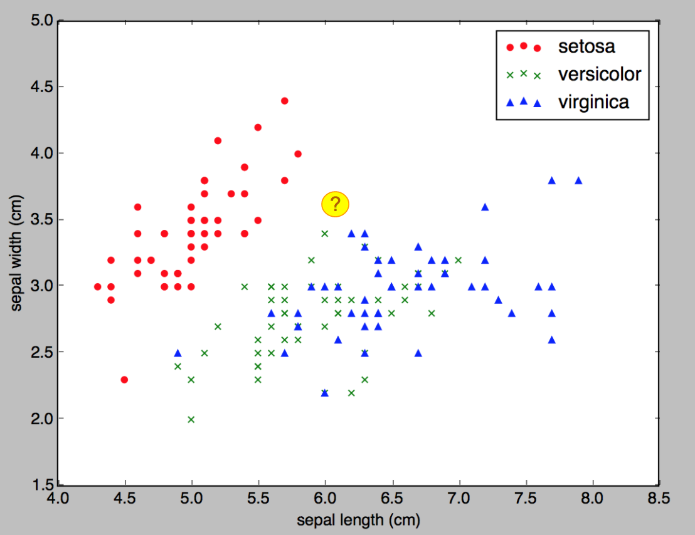
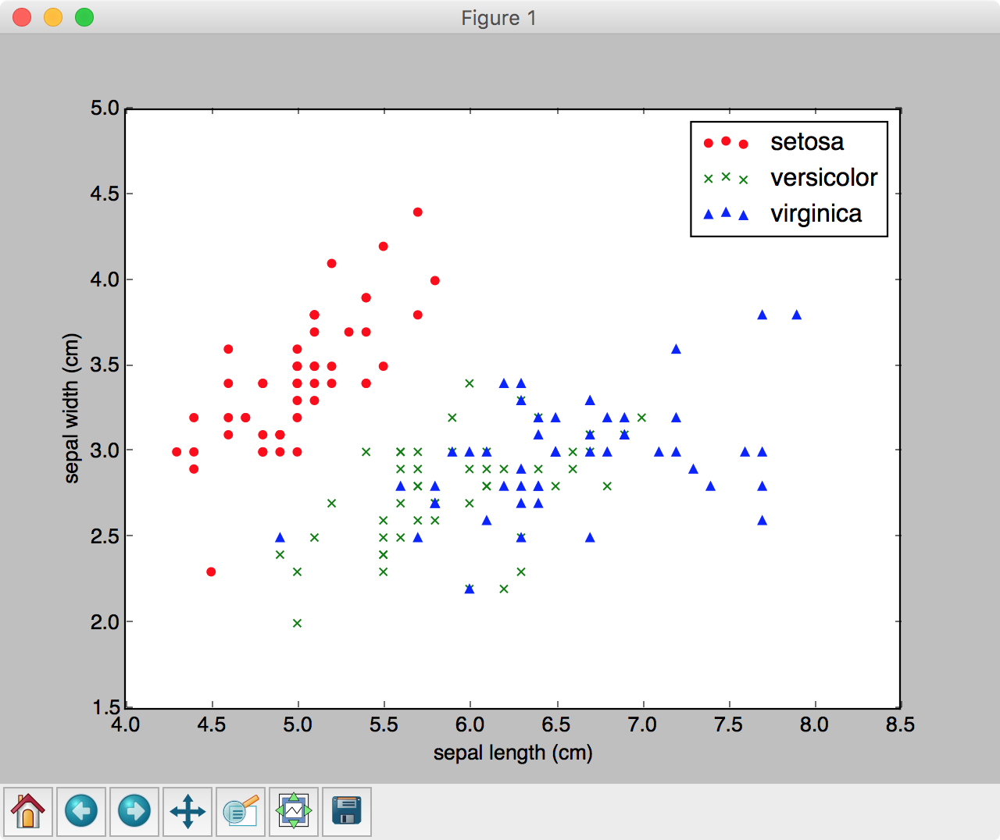
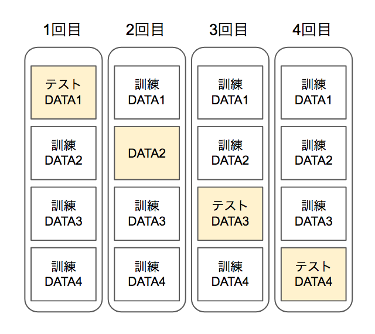
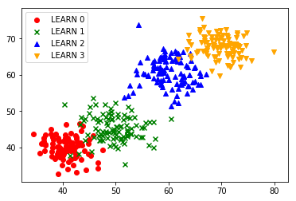

## 演習2 - 教師あり学習（分類問題）

続いてデータの分類を行う機械学習プログラムを見てみましょう。

> 教師あり学習で扱う問題は、回帰と分類に分かれます。

ここではk-NN法（k-nearest neighbor algorithm）を取り上げます。

### k-NN法による分類

k-NN法はk近傍法とも呼ばれます。k近傍法は最寄りのデータを参考に分類を行うシンプルなアルゴリズムです。

続いてデータの分類を行う機械学習プログラムを見てみましょう。

> 教師あり学習で扱う問題は、回帰と分類に分かれます。

ここではk-NN法（k-nearest neighbor algorithm）を取り上げます。日本語ではk近傍法とも呼ばれます。k近傍法は最寄りのデータを参考に分類を行うシンプルなアルゴリズムです。



例えば、x0、x1 の2点で構成されるデータの場合を考えてみましょう。これは説明変数が2つというケースですが、このようなケースは2次元のグラフ上に表現できます。k-NN法では、予め訓練データをこのグラフ上に表現しておき、未知のデータを投入した際に、最も近くにある点（データ）を参考に分類を行います。


> 実際には最寄りの1点だけで決定するのではなく、最寄りの3点、5点とパラメータを調整することができます。

<div style="page-break-before:always"></div>

### iris（アヤメ）データの分類 - 1 CSVファイルの分類

ここではテストデータとしてiris（アヤメ）データの分類にチャレンジします。具体的には次のようなCSVデータを訓練データに使います。

```csv
...
1,4.8,1.4
1,5.0,1.7
1,4.5,1.5
1,3.5,1.0
2,6.0,2.5
2,5.1,1.9
2,5.9,2.1
...
```

> ここでは60件の訓練データファイル（train01.csv）とテストデータファイル（test01.csv）を用意しています。


データは3列で構成しています。先頭列は品種を示します。1は'versicolor', 2は'virginica'という品種です。2列目、3列目はpetal（花びら）の縦、横幅です。

> 1,4.8,1.4 の場合、品種は 1:'versicolor' 花びらの縦幅 4.8cm、 横幅: 1.4cmという具合です。

<div style="page-break-before:always"></div>


それでは実際にirisデータの分類にチャレンジしてみましょう。

```python
import numpy as np
from sklearn.neighbors import KNeighborsClassifier

train = np.loadtxt("train01.csv",delimiter=",")
test = np.loadtxt("test01.csv",delimiter=",")

x_train = train[:,1:]
y_train = train[:,0]

x_test = test[:,1:]
y_test = test[:,0]

clf = KNeighborsClassifier()
clf.fit(x_train, y_train)

y_pred = clf.predict(x_test)
print(y_pred)
print(y_test)
print(clf.score(x_test, y_test))
```

実行結果は次のようになるでしょう。

```
ris_csv.py
[ 1.  1.  1.  1.  1.  1.  1.  1.  1.  1.  1.  1.  1.  1.  1.  1.  1.  1.
  1.  1.  2.  2.  2.  1.  2.  2.  2.  2.  2.  2.  2.  2.  2.  2.  2.  2.
  2.  2.  2.  2.]
[ 1.  1.  1.  1.  1.  1.  1.  1.  1.  1.  1.  1.  1.  1.  1.  1.  1.  1.
  1.  1.  2.  2.  2.  2.  2.  2.  2.  2.  2.  2.  2.  2.  2.  2.  2.  2.
  2.  2.  2.  2.]
0.975
```

予測値と期待値はほぼ一致し、結果は97.5%という高い正答率となっています。

<div style="page-break-before:always"></div>

それではプログラムの詳細を見てみましょう。

scikit-learnでk-NN法による分類を行うには KNeighborsClassifier クラスをimportします。

```python
from sklearn.neighbors import KNeighborsClassifier
```

次にNumPyのloadtxtメソッドを使ってCSVファイルをロードし、訓練データとテストデータに分類しています。

```python
train = np.loadtxt("train01.csv",delimiter=",")
test = np.loadtxt("test01.csv",delimiter=",")

x_train = train[:,1:]
y_train = train[:,0]

x_test = test[:,1:]
y_test = test[:,0]
```

CSVファイルをロードした後、先頭列（解答）とそれ以外の列を分離しています。

> 機械学習では訓練データを使って学習し、テストデータで正答率を検証します。これによってモデルの汎化性能を評価します。


次に KNeighborsClassifier オブジェクトを生成しています。このようなデータの分類を行うオブジェクトは分類器などと呼ばれます。

```python
clf = KNeighborsClassifier()
clf.fit(x_train, y_train)
```

分類器を生成した後、clf.fitメソッドを呼び出して訓練データによる学習をスタートします。

学習を終えたら、テストデータで結果を検証してみましょう。ここでは予測値と期待値（y_test）を並べて出力しています。それからclf.scoreメソッドによって正答率も出力していています。

```python
print(clf.predict(x_test))
print(y_test)
print(clf.score(x_test, y_test))
```

<div style="page-break-before:always"></div>


#### 参考：分類問題の評価指標

分類問題の評価指標についても確認しておきましょう。分類問題では、混同行列（Confusion Matrix）を確認する他、以下の評価指標を使います。

+ 正答率（Accuracy）
  + テストデータの中で正解した割合
+ 適合率（Precision）
  + Precision = TP / (TP + FP)
  + 真（Positive）と予測した中で、正解した割合
+ 再現率（Recall）
  + Recall = TP / (TP + FN)
  + 結果が真のデータの中で、正解した割合
+ F値（F1 Score）
  + F1 Score= (2 \* Precision \* Recall)  / (Precision + Recall)
  + 1に近いほど良い

scikit-learnでは sklearn.metrics の中に評価指標を出力するユーティリティが用意されています。

<div style="page-break-before:always"></div>


```python
import numpy as np
from sklearn.neighbors import KNeighborsClassifier
from sklearn.metrics import confusion_matrix, accuracy_score
from sklearn.metrics import precision_score, recall_score, f1_score

train = np.loadtxt("train01.csv",delimiter=",")
test = np.loadtxt("test01.csv",delimiter=",")

x_train = train[:,1:]
y_train = train[:,0] -1

x_test = test[:,1:]
y_test = test[:,0] - 1

clf = KNeighborsClassifier()
clf.fit(x_train, y_train)

y_pred = clf.predict(x_test)
print(y_pred)
print(y_test)
print(clf.score(x_test, y_test))

print("confusion_matrix:\n", confusion_matrix(y_test, y_pred))
print("accuracy_score:", accuracy_score(y_test, y_pred))
print("precision_score:", precision_score(y_test, y_pred))
print("recall_score:", recall_score(y_test, y_pred))
print("f1_score:", f1_score(y_test, y_pred))
```

プログラムを実行すると次のような結果を確認できるでしょう。

```
[0. 0. 0. 0. 0. 0. 0. 0. 0. 0. 0. 0. 0. 0. 0. 0. 0. 0. 0. 0. 1. 1. 1. 0.
 1. 1. 1. 1. 1. 1. 1. 1. 1. 1. 1. 1. 1. 1. 1. 1.]
[0. 0. 0. 0. 0. 0. 0. 0. 0. 0. 0. 0. 0. 0. 0. 0. 0. 0. 0. 0. 1. 1. 1. 1.
 1. 1. 1. 1. 1. 1. 1. 1. 1. 1. 1. 1. 1. 1. 1. 1.]
0.975
confusion_matrix:
 [[20  0]
 [ 1 19]]
accuracy_score: 0.975
precision_score: 1.0
recall_score: 0.95
f1_score: 0.9743589743589743
```

> いずれの関数も1を真（0を偽）として処理します。そのため x_train、y_trainの値を調整しています。

<div style="page-break-before:always"></div>

### iris（アヤメ）データの分類 - 2 scikit-learnの付属データの確認

先ほどのサンプルでは予め用意していたCSVファイルで学習を行いました。機械学習プログラミングに取り組むには、このようなデータの準備作業も無視できない作業になります。

scikit-learnにはプログラミングの勉強目的に使えるテストデータがいくつか用意されています。

http://scikit-learn.org/stable/datasets/index.html#toy-datasets

ここでは scikit-learn に付属するload_irisメソッドを使って iris（アヤメ）データを扱う方法を見ていきましょう。次のプログラムはscikit-learnに付属するirisデータを出力します。


```python
import numpy as np
from sklearn.datasets import load_iris

iris = load_iris()
print(iris.keys())

print(iris.feature_names)
print(iris.data.shape)
print(iris.data[0])

print(iris.target_names)
print(iris.target.shape)
print(iris.target[0])
```

実行結果は次のようになるでしょう。

```
dict_keys(['target', 'target_names', 'feature_names', 'data', 'DESCR'])
['sepal length (cm)', 'sepal width (cm)', 'petal length (cm)', 'petal width (cm)']
(150, 4)
[ 5.1  3.5  1.4  0.2]
['setosa' 'versicolor' 'virginica']
(150,)
0
```

<div style="page-break-before:always"></div>

プログラムの詳細を見てみましょう。

scikit-learnに付属するirisデータをロードするには load_iris メソッドを使います。

```python
from sklearn.datasets import load_iris

iris = load_iris()
```

ロードしたirisデータはディクショナリのようなオブジェクトでキーと値で管理されています。

```python
print(iris.keys())
#=> dict_keys(['target', 'target_names', 'feature_names', 'data', 'DESCR'])

print(iris.feature_names)
#=> ['sepal length (cm)', 'sepal width (cm)', 'petal length (cm)', \
    # 'petal width (cm)']
print(iris.data.shape)
#=> (150, 4)
print(iris.data[0])
#=> [ 5.1  3.5  1.4  0.2]

print(iris.target_names)
#=> ['setosa' 'versicolor' 'virginica']
print(iris.target.shape)
#=> (150,)
print(iris.target[0])
#=> 0
```

irisデータは150件あります。また1件のレコードは4つの列（'sepal length', 'sepal width', 'petal length', 'petal width'）で構成されています。

> sepalは"萼(がく)"、petalは"花びら"を意味します。

また、さきほどのCSVのサンプルでは品種は2種類（'versicolor' 'virginica'）でしたが、load_irisで取得したirisデータの品種は3種類（'setosa' 'versicolor' 'virginica'）です。それぞれ 0:'setosa'、 1: 'versicolor' 、 2:'virginica' となっています。


<div style="page-break-before:always"></div>

もう少しirisデータを考察してみましょう。次のプログラムはirisデータを散布図として表示します。


```python
import numpy as np
import matplotlib.pyplot as plt
from sklearn.datasets import load_iris

iris = load_iris()
data = np.c_[iris.target, iris.data]

plt.scatter(data[data[:,0]==0,1], data[data[:,0]==0,2], marker='o', \
                                      color='red', label='setosa')
plt.scatter(data[data[:,0]==1,1], data[data[:,0]==1,2], marker='x', \
                                      color='green', label='versicolor')
plt.scatter(data[data[:,0]==2,1], data[data[:,0]==2,2], marker='^', \
                                      color='blue', label='virginica')

plt.xlabel('sepal length (cm)')
plt.ylabel('sepal width (cm)')
plt.legend()

plt.show()
```

実行結果は次のようになるでしょう。



プログラムの詳細を見てみましょう。まずはirisデータをロードする部分です。

```python
iris = load_iris()
data = np.c_[iris.target, iris.data]
```

ここでは、iris.targetとiris.dataを1つのレコードとして連結しています。

> 1行目のレコードは、[0, 5.1, 3.5, 1.4, 0.2] のようになります。先頭に解答ラベルが付きます。

次に3種類の品種をそれぞれ異なるマーカーで散布図に出力しています。

```python
plt.scatter(data[data[:,0]==0,1], data[data[:,0]==0,2], marker='o', \
                                      color='red', label='setosa')
plt.scatter(data[data[:,0]==1,1], data[data[:,0]==1,2], marker='x', \
                                      color='green', label='versicolor')
plt.scatter(data[data[:,0]==2,1], data[data[:,0]==2,2], marker='^', \
                                      color='blue', label='virginica')
```

ここではNumPyを使ってやや高度なレコードの絞り込みを行っています。たとえば、data[:,0]==0 とすると、先ほど連結したレコードの1列目が 0 のレコードだけに絞り込むことができます。さらに data[data[:,0]==0,1] とすれば1列目が0のレコードの2列目（sepal length）だけを指定することができます。

最後にラベルを設定してグラフを表示しています。

```python
plt.xlabel('sepal length (cm)')
plt.ylabel('sepal width (cm)')
plt.legend()

plt.show()
```

<div style="page-break-before:always"></div>


### iris（アヤメ）データの分類 - 3 scikit-learnの付属データの分類

最後にscikit-learnのirisデータを使って、あらためてk-NN法にチャレンジしてみましょう。


```python
import numpy as np
import matplotlib.pyplot as plt
from sklearn.datasets import load_iris
from sklearn.neighbors import KNeighborsClassifier
from sklearn.model_selection import train_test_split

iris = load_iris()

x_train, x_test, y_train, y_test = train_test_split(iris.data, iris.target)

clf = KNeighborsClassifier(n_neighbors=3)

clf.fit(x_train, y_train)

print(clf.score(x_test, y_test))

unknown_data = [[5.0, 4.1, 1.5, 0.5]]
print(clf.predict(unknown_data))
```

実行結果は次のようになるでしょう。

```
0.921052631579
[0]
```

正答率は92%となりました。また、未知のデータ[5.0, 4.1, 1.5, 0.5]の品種は 0:'setosa' と分類しています。

<div style="page-break-before:always"></div>

プログラムの詳細を見てみましょう。

今回は150件のirisデータを訓練データとテストデータに分離するためにscikit-learnのユーティリティ関数train_test_splitをimportしています。

```python
from sklearn.model_selection import train_test_split
```

train_test_split関数は、引数で受け取ったデータを訓練データとテストデータに分離します。デフォルトでは25%をテストデータに割り当てるので、ここでは112件の訓練データ、38件のテストデータに分離します。

```python
x_train, x_test, y_train, y_test = train_test_split(iris.data, iris.target)
```

後の訓練データの学習、テストデータの検証はこれまでとおりです。

```python
clf = KNeighborsClassifier(n_neighbors=3)

clf.fit(x_train, y_train)

print(clf.score(x_test, y_test))

unknown_data = [[5.0, 4.1, 1.5, 0.5]]
print(clf.predict(unknown_data))
```

KNeighborsClassifierオブジェクトを生成するときにパラメータn_neighbors=3を指定しています。これにより最寄りの3つのデータから分類を行うようになります。

<div style="page-break-before:always"></div>


#### 参考：学習済みモデルの評価

学習済みモデルの評価方法についても確認しておきましょう。機械学習では、訓練データを使って学習し、テストデータを使って汎化性能を測定するのでした。このときK-分割交差検証というアプローチをとることができます。



scikit-learnでK-分割交差検証を行うにはsklearn.model_selectionにあるKFoldクラスやcross_val_scoreユーティリティを使います。ここではcross_val_scoreを試してみましょう。

```python
import numpy as np
import matplotlib.pyplot as plt
from sklearn.datasets import load_iris
from sklearn.neighbors import KNeighborsClassifier
from sklearn.model_selection import cross_val_score

iris = load_iris()

clf = KNeighborsClassifier(n_neighbors=3)

scores = cross_val_score(clf, iris.data, iris.target, cv=4)

print("K-fold cross validation:", scores)
print("mean accuracy:", scores.mean());
```

実行結果は次のようになります。

```
K-fold cross validation: [0.97435897 0.94871795 0.91666667 1.        ]
```

4回の検証結果が表示されているのがわかります。


<!--

### KFoldクラス実装例

```python
import numpy as np
import matplotlib.pyplot as plt
from sklearn.datasets import load_iris
from sklearn.neighbors import KNeighborsClassifier
from sklearn.model_selection import KFold

iris = load_iris()

clf = KNeighborsClassifier(n_neighbors=3)

for train_idx, test_idx in KFold(n_splits=4, shuffle=True).split(iris.data, iris.target):
    x_train = iris.data[train_idx]
    y_train = iris.target[train_idx]
    x_test = iris.data[test_idx]
    y_test = iris.target[test_idx]

    clf.fit(x_train, y_train)
    print(clf.score(x_test, y_test))
```

> StratifiedKFoldはクラスの割合を保持してKFoldを行う。

-->


<div style="page-break-before:always"></div>


### 演習課題（教師あり学習-分類問題）

次のデータは、架空の400校の学習方法（learn）と、数学のテスト結果（math）と物理のテスト結果（physics）の結果をまとめたものです。

> 学習方法（learn）には4つの方法（0〜3）が存在します。

|learn|math|physics|
|:--|:--|:--|
|0|44.87|38.16|
|0|...|...|
|1|48.61|47.85|
|1|...|...|
|2|55.47|60.26|
|2|...|...|
|3|66.78|69.49|
|3|...|...|

> ここでは配布資料のex_class.csvファイルを使います。

400校のデータを散布図として表示すると次のようになります。

```python
import numpy as np
import matplotlib.pyplot as plt
from sklearn.model_selection import train_test_split

data = np.loadtxt("./ex_class.csv", delimiter=',')

plt.scatter(data[data[:,0]==0,1], data[data[:,0]==0,2], marker='o', \
                                      color='red', label='LEARN 0')
plt.scatter(data[data[:,0]==1,1], data[data[:,0]==1,2], marker='x', \
                                      color='green', label='LEARN 1')
plt.scatter(data[data[:,0]==2,1], data[data[:,0]==2,2], marker='^', \
                                      color='blue', label='LEARN 2')
plt.scatter(data[data[:,0]==3,1], data[data[:,0]==3,2], marker='v', \
                                      color='orange', label='LEARN 3')
plt.legend()
plt.show()
```




ここではk-NN法を使って数学、物理のテスト結果から、いずれの学習方法が適用されたかを分類するプログラムを作成します。

> k-NN法では最寄りの5点から分類するものとします。

```python
import numpy as np
import matplotlib.pyplot as plt
from sklearn.model_selection import train_test_split
from sklearn.neighbors import KNeighborsClassifier

data = np.loadtxt("./ex_class.csv", delimiter=',')

x = data[:,1:]
y = data[:,0]

x_train, x_test, y_train, y_test = ???(x, y)

model = KNeighborsClassifier()
model.???(x_train, y_train)

model.???(x_test, y_test)
```

次のような実行結果（正答率）が表示されることを確認してください。

```
0.93999999999999995
```

<div style="page-break-before:always"></div>

#### 参考：推論利用

学習済みモデルでテストデータを推論してみましょう。

```python
y_pred = model.???(x_test)
print(y_pred)
# print(y_test)
```

次のような実行結果が表示されることを確認してください。

```
[ 2.  2.  1.  1.  3.  3.  1.  3.  2.  2.  0.  1.  2.  3.  2.  2.  2.  3.
  3.  2.  3.  1.  0.  2.  0.  3.  2.  1.  1.  2.  1.  0.  3.  3.  3.  0.
  2.  0.  3.  3.  3.  0.  2.  3.  0.  2.  0.  3.  1.  2.  0.  2.  0.  1.
  3.  3.  0.  2.  0.  2.  3.  0.  2.  2.  2.  1.  0.  0.  0.  0.  1.  0.
  0.  1.  3.  1.  2.  0.  3.  0.  0.  1.  2.  0.  3.  2.  0.  0.  0.  3.
  1.  1.  1.  1.  0.  1.  1.  1.  0.  2.]
```

> print(y_test)の結果と比較してみましょう。


<!--

### 推論利用の例

```python
pred = model.predict(x_test)

print(pred)
print(y_test)

plt.scatter(x_test[pred==0,0], x_test[pred==0,1], marker='o', \
                                      color='red', label='LEARN 0')
plt.scatter(x_test[pred==1,0], x_test[pred==1,1], marker='x', \
                                      color='green', label='LEARN 1')
plt.scatter(x_test[pred==2,0], x_test[pred==2,1], marker='^', \
                                      color='blue', label='LEARN 3')
plt.scatter(x_test[pred==3,0], x_test[pred==3,1], marker='v', \
                                      color='orange', label='LEARN 4')
plt.legend()
plt.show()
```

-->
