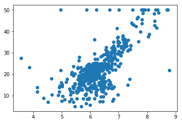
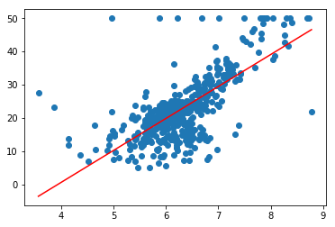

# 6 総合演習

## 総合演習1 - 住宅価格データの予測

scikit-learnに付属されているボストン住宅価格データセットを使って機械学習に取り組みます。

> 課題のノートブック名は「yourname_boston」としてください。


http://scikit-learn.org/stable/modules/generated/sklearn.datasets.load_boston.html

ボストン住宅価格データセットは14個の属性（列）、506行のレコードで構成されています。各属性の情報は以下の通りです。

|No|項目名|意味|
|:--|:--|:--|
|1|CRIM|1人当たり犯罪発生率<br>per capita crime rate by town|
|2|ZN|25,000平方フィート以上のロット用にゾーン化された住宅地の割合<br>proportion of residential land zoned for lots over 25,000 sq.ft.|
|3|INDUS|町ごとの非小売業種の割合<br>proportion of non-retail business acres per town|
|4|CHAS|チャールズ川のダミー変数（河川境界線の場合は1、そうでない場合は0）<br>Charles River dummy variable (= 1 if tract bounds river; 0 otherwise)|
|5|NOX|酸化窒素濃度（1,000万分の1）<br>nitric oxides concentration (parts per 10 million)|
|6|RM|住居あたりの平均部屋数<br>average number of rooms per dwelling|
|7|AGE|1940年以前に建設された所有者占有ユニットの割合<br>proportion of owner-occupied units built prior to 1940|
|8|DIS|5つのボストン雇用センターへの加重距離<br>weighted distances to five Boston employment centres|
|9|RAD|放射状の高速道路へのアクセス可能性の指標<br>index of accessibility to radial highways|
|10|TAX|1万ドルあたりの全額物件税率<br>full-value property-tax rate per $10,000|
|11|PTRATIO|町ごとの教師比<br>pupil-teacher ratio by town|
|12|B|黒人の割合 ※ 数式 1000(Bk - 0.63)^2 BKは黒人の割合<br>1000(Bk - 0.63)^2 where Bk is the proportion of blacks by town|
|13|LSTAT|人口の低いステータス％<br>% lower status of the population|
|14|MEDV|住宅価格（$1000単位の中央値）<br>Median value of owner-occupied homes in $1000's|

> ボストン住宅価格データセットは以下のURLで公開されています。 http://lib.stat.cmu.edu/datasets/boston


### 課題1.1 - データセットの確認

以下の仕様に従って、データセットの概要を出力してください。

+ 項目の一覧（feature names）を出力する
+ データの形状（data shape）を出力する
+ ターゲットの形状（target shape）を出力する

#### 実行結果

```
-- feature names --
['CRIM' 'ZN' 'INDUS' 'CHAS' 'NOX' 'RM' 'AGE' 'DIS' 'RAD' 'TAX' 'PTRATIO'
 'B' 'LSTAT']
-- data sahpe --
(506, 13)
-- target sahpe --
(506,)
```

#### ヒント

```python
from sklearn.datasets import ???

boston = ???()

print("-- feature names --")
print(boston.???)
print("-- data sahpe --")
print(boston.???.???)
print("-- target sahpe --")
print(boston.???.???)
```

<div style="page-break-before:always"></div>


### 課題1.2 - 単回帰分析 - 散布図の表示

RM項目（平均部屋数）と住宅価格（MEDV）の散布図を出力してください。

#### 結果




#### ヒント

```
import matplotlib.pyplot as plt

x = boston.???
y = boston.???

plt.???(x, y)
plt.show()
```

<div style="page-break-before:always"></div>

### 課題1.3 - 単回帰分析 - 係数と切片の取得

以下の仕様に従って、住宅価格（MEDV）を予測する機械学習プログラムを作成してください。

+ データは訓練データ（329件）とテストデータ（127件）に分割するものとします。
+ RM項目を使って住宅価格（MEDV）を予測します。アルゴリズムには線形回帰を使うものとし、訓練データによって係数（傾き）と切片を出力してください。

#### 結果

```
-- coef --
[ 9.25264974]
-- intercept --
-35.720006279
```

> 訓練データとテストデータをランダムに分割しているため、上記とは異なる結果が表示されることがあります。

#### ヒント

```python
from sklearn.linear_model import ???
from sklearn.model_selection import ???

train_x, test_x, train_y, test_y = ???(x, y)

reg = ???()
reg.???(train_x, train_y)

print("-- coef --")
print(reg.???)
print("-- intercept --")
print(reg.???)
```

<div style="page-break-before:always"></div>

### 課題1.4 - 単回帰分析 - 評価

テストデータを使って評価します。

+ 決定係数（R-squared）を求めてください。
+ 平均二乗誤差（mean_squared_error）を求めてください。

> 決定係数はLinearRegressionインスタンスのscoreメソッドで出力できます。

#### 結果

```
-- score --
0.440066139183
-- mean squared error --
41.8994859401
```

> 訓練データとテストデータをランダムに分割しているため、上記とは異なる結果が表示されることがあります。


#### ヒント

```python
from sklearn.metrics import mean_squared_error

print("-- score --")
print(reg.???(test_x, test_y))

y_pred = reg.???(test_x)
print("-- mean squared error --")
print(mean_squared_error(y_pred, test_y))
```

<div style="page-break-before:always"></div>


#### （参考）回帰問題の評価尺度

分類問題の場合は、テストデータで正答率（Accuracy）を求めます。一方、回帰問題は決定係数や平均絶対誤差、平均二乗誤差を評価尺度とします。

|評価指標|日本語名|意味|
|:--|:--|:--|
|Mean Squared Error|平均二乗誤差|正解と予測値の差の二乗の平均値<br>0に近いほど精度は高い|
|Mean Absolute Error|平均絶対誤差|正解と予測値の差（絶対値）の平均値<br>0に近いほど精度は高い|
|Root Mean Squared Error|二乗平均平方根誤差|正解と予測値の差の二乗の平均値の平方根<br>0に近いほど精度は高い|
|Relative Absolute Error|相対絶対誤差|平均絶対誤差を正規化したもの<br>0に近いほど精度は高い|
|Relative Squared Error|相対二乗誤差|二乗平均平方根誤差を正規化したもの<br>0に近いほど精度は高い|
|Coefficient of Determination|決定係数|期待値と実測値の差を0〜1で表現したのもの<br>1に近いほど精度は高い|

<div style="page-break-before:always"></div>


### 課題1.5 - 単回帰分析 - 回帰直線の表示

求めた係数と切片を使って、散布図上に回帰直線を表示してください。

#### 結果



#### ヒント

```python
import numpy as np

x_range = np.linspace(x.min(), x.max(), 100)
y_range = ???

plt.???(x, y)
plt.???(x_range, y_range, color="red")
plt.show()
```

<div style="page-break-before:always"></div>

### 課題1.6 - 重回帰分析

以下の仕様に従って、住宅価格（MEDV）を予測する機械学習プログラムを作成してください。

+ データは訓練データ（329件）とテストデータ（127件）に分割するものとします。
+ すべての項目を使って住宅価格（MEDV）を予測します。アルゴリズムには線形回帰を使うものとし、訓練データによって係数（傾き）と切片を出力してください。
+ テストデータによって学習済みのモデルを評価し、決定係数と平均二乗誤差を出力してください。

#### 結果

```
-- coef --
[ -1.01899681e-01   3.92229240e-02   5.74136275e-02   3.48991428e+00
  -1.94275099e+01   4.45392731e+00   1.72863653e-03  -1.44676386e+00
   2.46659335e-01  -1.00613966e-02  -9.98191471e-01   1.16488958e-02
  -5.18238396e-01]
-- intercept --
32.2486275702
-- score --
0.590359700459
-- mean squared error --
26.9400779849
```

> 訓練データとテストデータをランダムに分割しているため、上記とは異なる結果が表示されることがあります。
