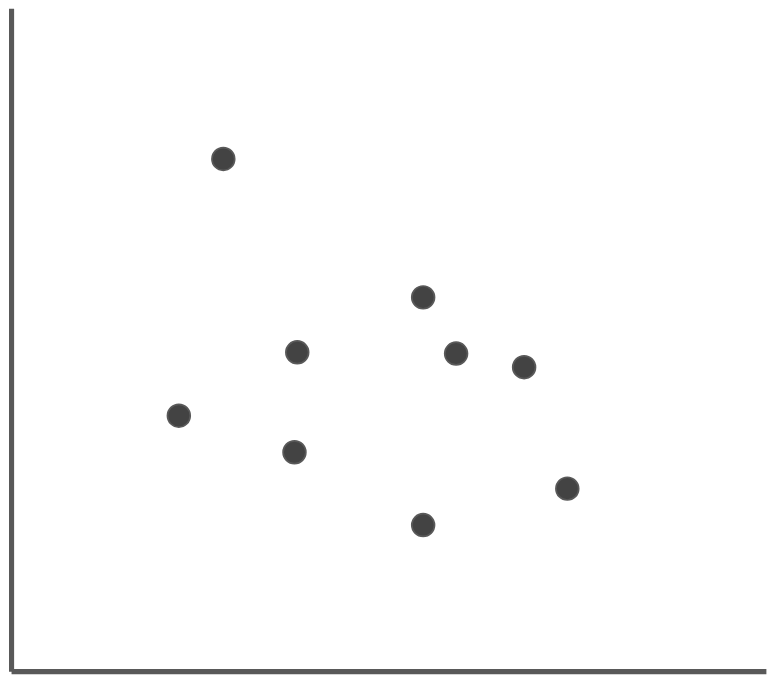
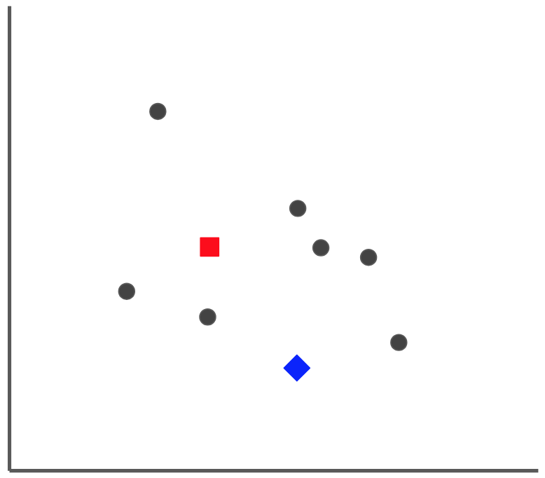
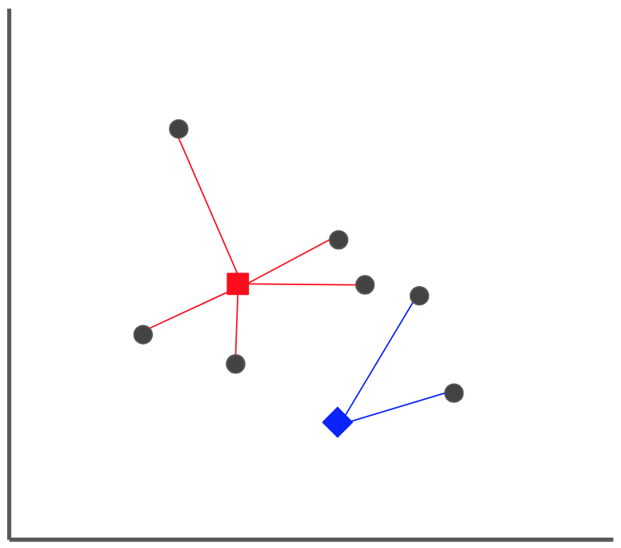
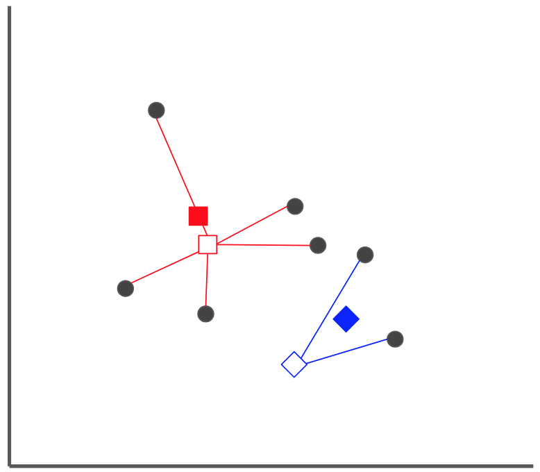
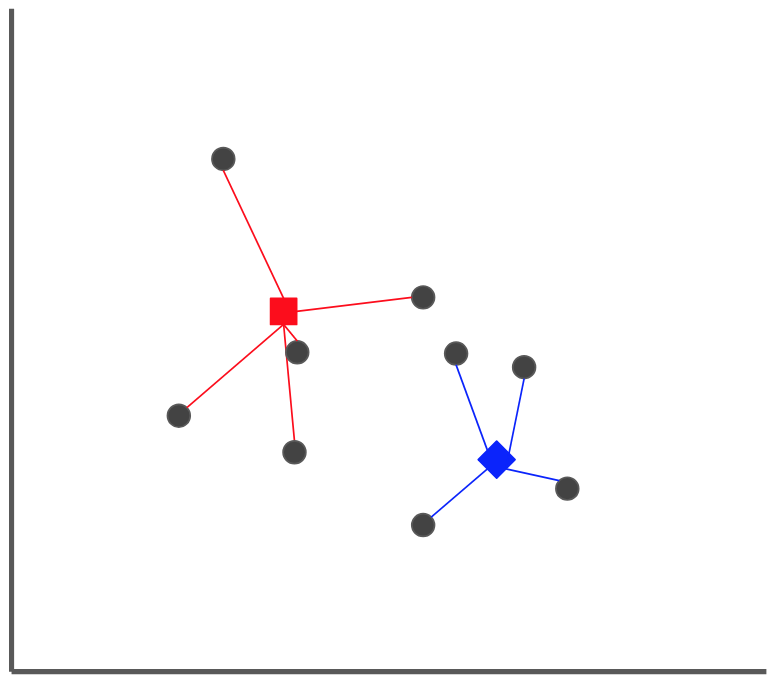
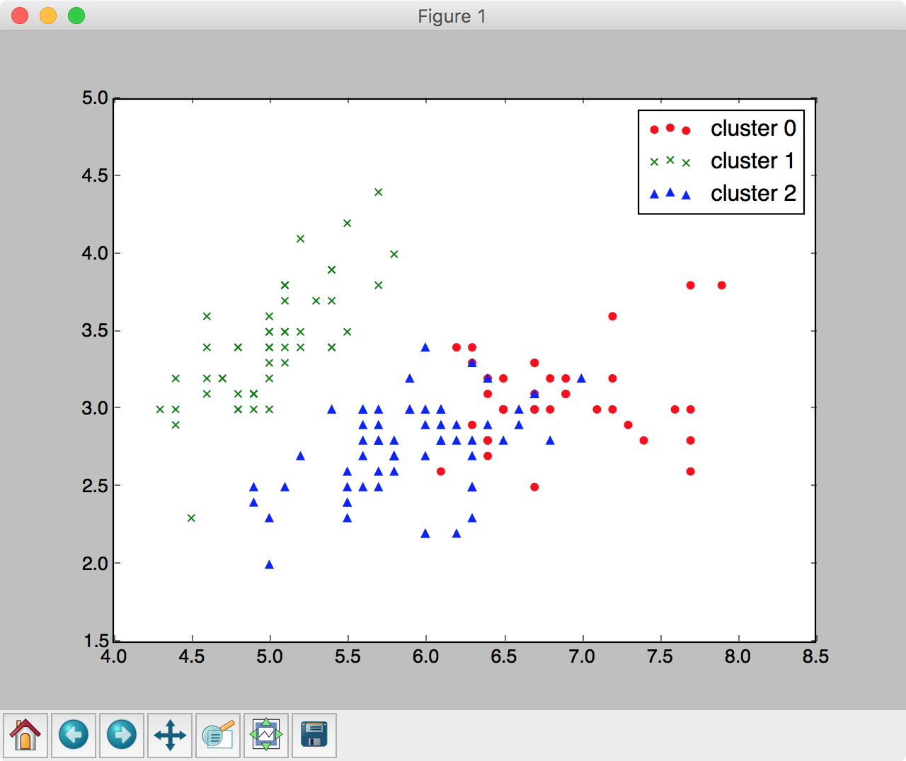

## 演習3 - 教師なし学習（クラスタリング）

続いて教師なし学習プログラムを取り上げます。教師なし学習はクラスタリングや次元圧縮といった目的で利用します。ここではirisデータの教師データを使わずに、データの傾向からクラスターを作成してみます。

## K-Means法

K-Means法（K平均法）は古くから活用されているクラスタリングアルゴリズムです。K-Means法は予め、分析者がクラスタリング数を指定することでデータの分類を行います。ここで分類と言いましたが、教師データを使うわけではなく、データの傾向をもとにグループ化（クラスタリング）していく流れになります。

k-Means法のおおまかな考え方は次のようになります。

1. クラスター数（K）を決定します。
1. データの中から基準となるデータ（シード）をランダムに選びます。
1. すべてのデータに対して最寄りのシードを決定します。K個のクラスターができあがります。
1. 各クラスターにおいて中心点を算出します。この中心点をシード新たなシードとします。（以降、3,4を繰り替えします）

### 参考：クラスタリング例

次の散布図に表示されたサンプルデータを2つのクラスター（K=2）に分割する方法を考えてみましょう。



まずデータの中からシードを2つ選びます。



すべてのデータに対して最寄りのシードを決定します。2つのクラスターができあがります。



各クラスターにおいて中心点を算出します。この中心点をシード新たなシードとします。



すべてのデータに対して最寄りのシードを決定します。



以上の作業を繰り返していくと、2つのクラスターに分類されます。


<div style="page-break-before:always"></div>


### Irisデータのクラスタリング

次のプログラムはIrisデータをクラスタリングするものです。ここではクラスター数に3を指定しています。

> 教師データを使っていないところに注目します。

```python
import numpy as np
import matplotlib.pyplot as plt
from sklearn.cluster import KMeans
from sklearn.datasets import load_iris

iris = load_iris()

model = ???(n_clusters=3)
model.???(iris.data)
print(model.labels_)

plt.scatter(iris.data[model.labels_==0,0], iris.data[model.labels_==0,1], \
                            marker='o', color='red', label='cluster 0')
plt.scatter(iris.data[model.labels_==1,0], iris.data[model.labels_==1,1], \
                            marker='x', color='green', label='cluster 1')
plt.scatter(iris.data[model.labels_==2,0], iris.data[model.labels_==2,1], \
                            marker='^', color='blue', label='cluster 2')

plt.legend()
plt.show()
```

実行結果は次のようになるでしょう。


```
[1 1 1 1 1 1 1 1 1 1 1 1 1 1 1 1 1 1 1 1 1 1 1 1 1 1 1 1 1 1 1 1 1 1 1 1 1
 1 1 1 1 1 1 1 1 1 1 1 1 1 2 2 0 2 2 2 2 2 2 2 2 2 2 2 2 2 2 2 2 2 2 2 2 2
 2 2 2 0 2 2 2 2 2 2 2 2 2 2 2 2 2 2 2 2 2 2 2 2 2 2 0 2 0 0 0 0 2 0 0 0 0
 0 0 2 2 0 0 0 0 2 0 2 0 2 0 0 2 2 0 0 0 0 0 2 0 0 0 0 2 0 0 0 2 0 0 0 2 0
 0 2]
```

> 150件のデータに対して、クラスターを示す 0,1,2 のいずれかのラベルが割り当てられています。

<div style="page-break-before:always"></div>


またグラフは次のように表示されるでしょう。




プログラムの詳細を見てみましょう。

k-Means法でクラスタリングを行うには次のようにKMeansクラスをimportします。

```python
from sklearn.cluster import KMeans
```

データを学習する流れは教師あり学習と同じです。モデルに対してfitメソッドを呼び出します。

```python
model = KMeans(n_clusters=3)

model.fit(iris.data)
```

さて学習した結果（クラスタリング情報）は model.labels_ プロパティで確認できます。

```python
print(model.labels_)
```

出力結果を見ると150件のレコードに 0, 1, 2のいずれかが割り振られているのがわかります。

<div style="page-break-before:always"></div>

最後にグラフに結果を出力しています。

```python
plt.scatter(iris.data[model.labels_==0,0], iris.data[model.labels_==0,1], \
                            marker='o', color='red', label='cluster 0')
plt.scatter(iris.data[model.labels_==1,0], iris.data[model.labels_==1,1], \
                            marker='x', color='green', label='cluster 1')
plt.scatter(iris.data[model.labels_==2,0], iris.data[model.labels_==2,1], \
                            marker='^', color='blue', label='cluster 2')

plt.legend()
plt.show()
```

<div style="page-break-before:always"></div>


### 演習課題（教師なし学習-クラスタリング）

次のデータは、架空の400校の数学のテスト結果（math）と物理のテスト結果（physics）の結果をまとめたものです。

|math|physics|
|:--|:--|
|44.87|38.16|
|38.42|36.78|
|42.60|33.10|
|45.23|37.72|
|40.13|41.75|
|...|...|

> ここでは配布資料のex_cluster.csvファイルを使います。

400校のデータを散布図として表示すると次のようになります。


上記のテスト結果をK-Means法で分析します。クラスター数を2から4まで変更して結果を確認してください。

<div style="page-break-before:always"></div>

```python
import numpy as np
import matplotlib.pyplot as plt
from sklearn.cluster import KMeans

data = np.loadtxt("./ex_cluster.csv", delimiter=',')

???

print(model.labels_)

plt.scatter(data[model.labels_==0, 0], data[model.labels_==0, 1],
                    marker="o", color="red", label="cluster 0")
plt.scatter(data[model.labels_==1, 0], data[model.labels_==1, 1],
                    marker="x", color="green", label="cluster 1")
plt.scatter(data[model.labels_==2, 0], data[model.labels_==2, 1],
                    marker="s", color="blue", label="cluster 2")
plt.scatter(data[model.labels_==3, 0], data[model.labels_==3, 1],
                    marker="^", color="orange", label="cluster 3")
plt.legend()
plt.show()
```

#### 参考：クラスター数が4の場合


<div style="page-break-before:always"></div>

### 参考：クラスター数の探し方

k-Means法ではクラスター数を設定しなくてはいけません。データの傾向からクラスター数を設計するには、エルボーメソッドやシルエットプロットといった方法があります。ここではエルボーメソッドによるクラスター数の探し方を紹介します。

```python
clusters = range(1, 10)
inertia_list = []
for k in clusters:
    model = KMeans(n_clusters=k)
    model.fit(data)
    inertia_list.append(model.inertia_)

plt.plot(clusters, inertia_list)
plt.show()
```

学習済みのモデルのinertia_プロパティにアクセスすると、クラスター中心への距離（2乗）の総和を取得できます。

プログラムを実行すると次のような結果が表示されるでしょう。


上記のグラフは横軸にクラスター数、縦軸に クラスター中心への距離（2乗）の総和 を表示しています。クラスター数が増えると距離の総和は小さくなりますが、クラスター数が4を過ぎる頃から減少が停滞しています。そのためクラスター数は4程度が妥当と推測することができます。

> グラフの結果が肘（Elbow）のような形を描くことからエルボーメソッドと呼ばれます。
